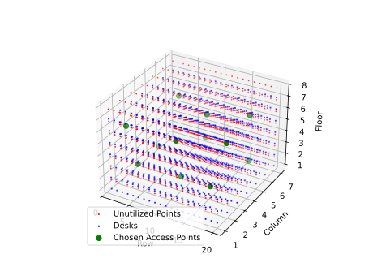

# WiFi Access Point Optimization in an Office Building

This code addresses the problem of optimizing WiFi coverage in a multi-floor office building. The goal is to **minimize the number of WiFi access points** (APs) installed while ensuring that every desk in the building is within a specified distance threshold for good signal strength.

## Problem Description

- **Objective**: Minimize the number of WiFi access points while ensuring full coverage.
- **Constraints**:
  - Every desk must be within a certain distance (750 cm) of at least one access point.
  - Access points can only cover desks within this distance threshold.
- **Building Specifications**:
  - Floors: 7
  - Rows per floor: 20
  - Columns per floor: 7
  - Floor height: 3 meters
  - Row length: 1.5 meters
  - Column width: 2.5 meters

## Approach

The problem is formulated as a **set covering problem** and solved using linear programming with the PuLP library. The key steps include:

1. **Modeling the Building Layout**: Generating the locations of all desks and potential access point positions.
2. **Calculating Distances**: Computing the Euclidean distance between every desk and every access point.
3. **Formulating the Optimization Problem**: Defining variables, objective function, and constraints.
4. **Solving the Problem**: Using PuLP to find the optimal placement of access points.
5. **Visualizing the Solution**: Plotting the desks and chosen access points in a 3D space.

## Code Explanation

### Importing Libraries

```python
import pulp
import random
import math
import matplotlib.pyplot as plt
from mpl_toolkits.mplot3d import Axes3D
```

- **pulp**: For formulating and solving the optimization problem.
- **random** and **math**: For generating locations and calculating distances.
- **matplotlib.pyplot** and **Axes3D**: For plotting the 3D visualization.

### Setting Parameters

```python
random.seed(1)

floors = 7
rows = 20
columns = 7
num_points = 200
floor_height = 3
row_length = 1.5
column_width = 2.5
random_generated_ap_locations = False
S = 750  # Distance threshold in centimeters
```

- **Building Dimensions**: Defined by `floors`, `rows`, and `columns`.
- **Physical Dimensions**: Real-world distances between points in the grid.
- **Distance Threshold (S)**: Maximum distance for good signal strength.

### Functions

#### 1. `plot_solution`

Plots the desks and access points in 3D space.

```python
def plot_solution(access_points, desks, chosen_access_point_keys):
    # Function body
```

- **Desks**: Plotted as blue squares.
- **Chosen Access Points**: Plotted as large green circles.
- **Unused Access Points**: Plotted as small red circles.

#### 2. `calculate_distance`

Calculates the Euclidean distance between a desk and an access point.

```python
def calculate_distance(desk, access_point):
    # Function body
```

- Considers the physical dimensions (`floor_height`, `row_length`, `column_width`).
- Returns the distance in centimeters.

#### 3. `generate_desk_locations`

Generates the positions of all desks in the building.

```python
def generate_desk_locations(floors=floors, rows=rows, columns=columns):
    # Function body
```

- Desks are placed at every grid point defined by the building dimensions.

#### 4. `generate_access_points`

Generates potential positions for access points.

```python
def generate_access_points(num_points=num_points, floors=floors, rows=rows, columns=columns, random_locations=random_generated_ap_locations):
    # Function body
```

- If `random_locations` is `False`, access points are placed systematically throughout the building.
- Access points are slightly elevated (`floor + 0.8`) to simulate ceiling placement.

#### 5. `calculate_distances`

Calculates distances between every desk and every access point.

```python
def calculate_distances(desk_locations, access_point_locations):
    # Function body
```

- Creates a distance matrix for use in the optimization problem.

### The Optimization Problem

```python
def problem():
    # Function body
```

#### Steps:

1. **Generate Locations**:

   ```python
   desk_locations = generate_desk_locations()
   access_point_locations = generate_access_points()
   desks = desk_locations.keys()
   access_points = access_point_locations.keys()
   ```

2. **Calculate Distances**:

   ```python
   distance_matrix = calculate_distances(desk_locations, access_point_locations)
   ```

3. **Create Coverage Matrix**:

   ```python
   a = {
       i: {j: 1 if distance_matrix[i][j] <= S else 0 for j in desks}
       for i in access_points
   }
   ```

   - `a[i][j] = 1` if access point `i` can cover desk `j`.

4. **Initialize the Problem**:

   ```python
   plp = pulp.LpProblem("AssignmentProblem", pulp.LpMinimize)
   ```

5. **Define Variables**:

   ```python
   y = pulp.LpVariable.dicts("y", (access_points), 0, 1, pulp.LpBinary)
   ```

   - `y[i]`: Binary variable indicating whether access point `i` is installed.

6. **Objective Function**:

   ```python
   plp += pulp.lpSum(y[i] for i in access_points)
   ```

   - Minimize the total number of access points installed.

7. **Constraints**:

   ```python
   for j in desks:
       plp += pulp.lpSum(a[i][j] * y[i] for i in access_points) >= 1
   ```

   - Each desk must be covered by at least one access point.

8. **Solve the Problem**:

   ```python
   plp.solve()
   ```

9. **Output the Results**:

   ```python
   print("Status:", pulp.LpStatus[plp.status])
   print("Minimum number of access points:", pulp.value(plp.objective))
   chosen_access_points = [i for i in access_points if pulp.value(y[i]) == 1]
   print("Chosen Access Points:", chosen_access_points)
   ```

10. **Plot the Solution**:

    ```python
    plot_solution(access_point_locations, desk_locations, chosen_access_points)
    ```

### Running the Optimization

```python
problem()
```

- Executes the entire optimization process and outputs the results.

## Visualization

The solution is visualized using a 3D scatter plot:

- **Blue Squares**: Desks.
- **Green Circles**: Chosen access points.
- **Red Circles**: Unused potential access points.

This helps in understanding the spatial distribution of desks and access points.

## Example Output

```
Status: Optimal
Minimum number of access points: 42.0
Chosen Access Points: ['AP-1-2-2', 'AP-1-5-5', ..., 'AP-7-17-3']
```

- **Status**: Indicates that an optimal solution was found.
- **Minimum number of access points**: The least number required to cover all desks.
- **Chosen Access Points**: List of access points that need to be installed.

## Visualized output

[View in interactive form](https://htmlpreview.github.io/?url=https://github.com/mackili/Location-Intelligence-1/blame/e8ba417d44f19144b8ba1fbd914e45debd5abb53/Assignments/access_point_plot.html)

## Conclusion

The code efficiently solves the WiFi access point placement problem by:

- **Minimizing Costs**: Reducing the number of access points lowers installation and maintenance costs.
- **Ensuring Coverage**: All desks are within the required distance for good WiFi signal strength.
- **Scalability**: The approach can be adapted for buildings of different sizes and configurations.

By utilizing linear programming and spatial analysis, the solution provides a practical method for network planning in large office environments.
